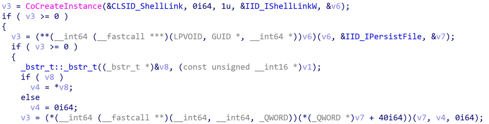
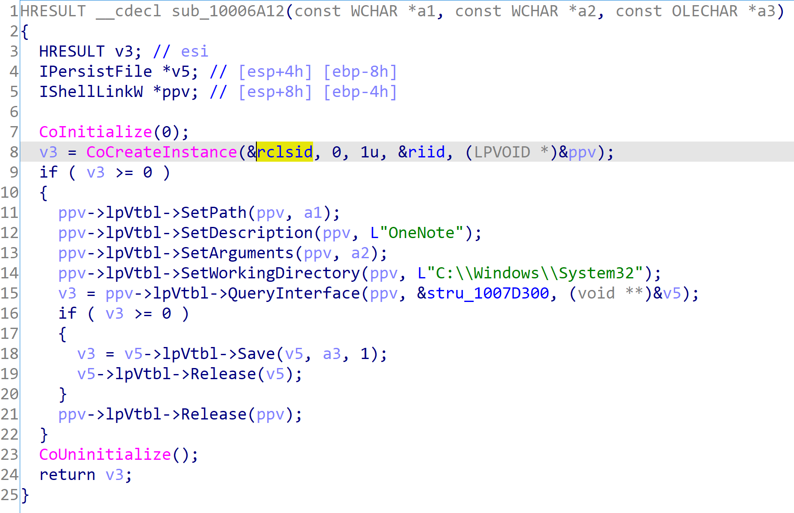
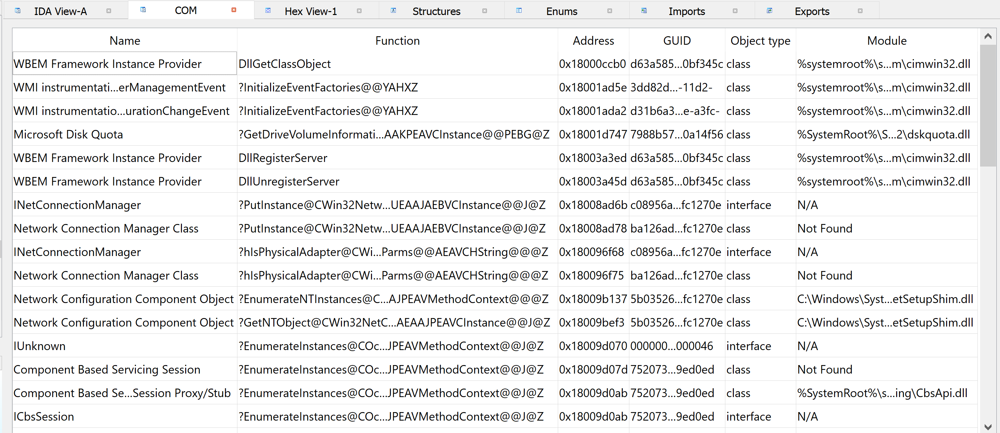
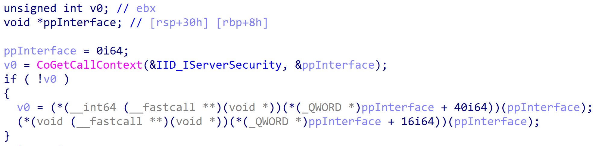
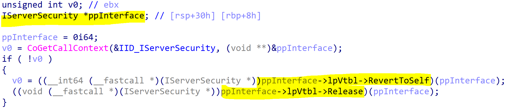

# ComIDA
An IDA Plugin that help during the analysis of modules using COM. It works by searching data references to known COM GUID (Classes or Interfaces), 
and for hex-ray plugin user, infers type that use : 
* `CoCreateInstance` function
* `CoGetCallContext` function
* `QueryInterface` method

BEFORE:


AFTER:


## How To Install ?

Just put the `comida.py` script in `plugins` folder of IDA.

```
git clone git@github.com:Airbus-CERT/comida.git
mklink "C:\\Program Files\\IDA Pro 7.4\\plugins\\comida.py" "comida\comida.py"
```

Launch your IDA and press `Ctrl-Shift-M` to activate it.

## How Does It Works ?

### COM Object References

`ComIDA` has two main features:

* Finding and Tracking GUID
* Type infering for Hex-Ray plugin users

To find and track GUID, we just search direct operand menmoniques, like `mov ax, GUID`, where GUID matches one present  in `HKCR\Classes` or in `HKCR\Interfaces` hives.

We preview the results in a table to interact and easily navigate through all COM object references.



Just double click to go to the interesting code.


### Type Infering

The main goal is to facilitate the work of the analyst. When a module uses COM services, it commonly uses:
* Create instance using `CoCreateInstance`
* Retrieve instance using `CoGetCallContext`
* Cast interface using method `QueryInterface` from `IUnknown` interface, which are inherited by every COM classes

comIDA will perform type infering for these patterns.

In comIDA, the infering works as the following:
1. Find interesting function
2. Read GUID parameter and retrieve interface type
3. Change type of the output variable

To find interesting function we have two kinds of heuristics, one for each type:
- For function type, like `CoCreateInstance` or `CoGetCallContext`, we directly search into import table.
- For method type, like `QueryInterface` we compute the method name thanks to the Hex-Rays AST.


After that, we use Hex-Ray hook to navigate into the function AST during decompilation step. When we spot a call to the interesting method, we perform a type change of the output parameter accordingly to the GUID parameter (GUID of the Interface).
To choose the correct type, we have two heuristics to select the type: 
* We check the name in the registry hive `HKCR\\Interfaces` associated with Interface GUID
* We try to cast directly into the symbol name associated with the third parameter (Mostly named `IID_IWbemLocator` etc... just take IWbemLocator)

And then the magic happened:

BEFORE:


AFTER:


BEFORE:


AFTER:

